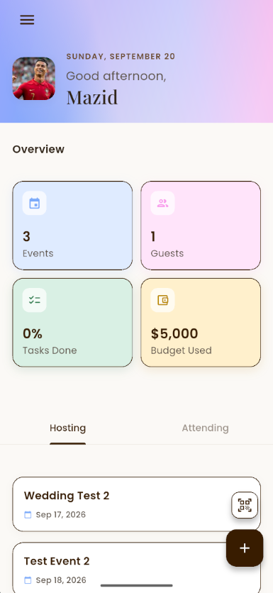
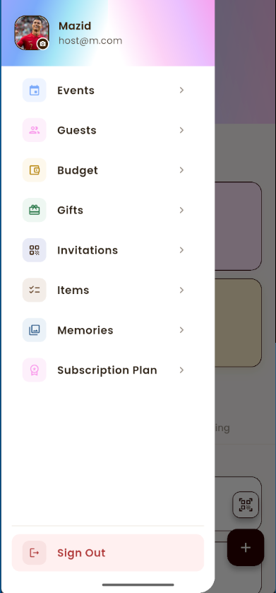
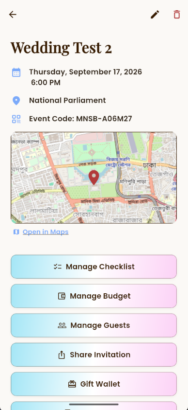
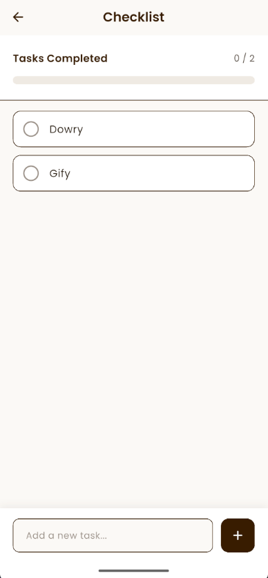
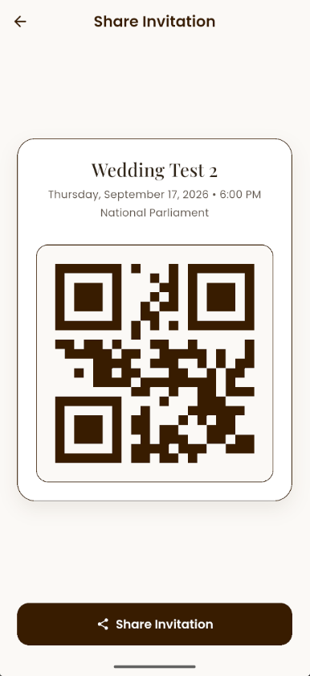
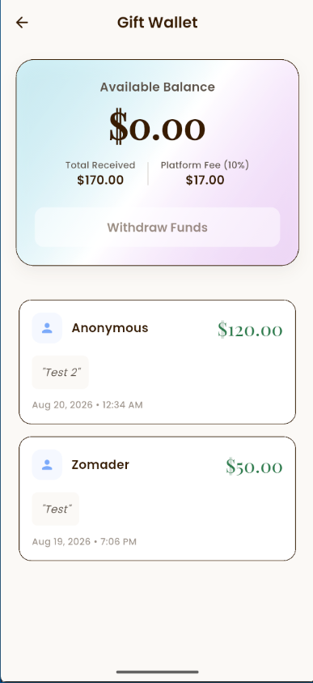
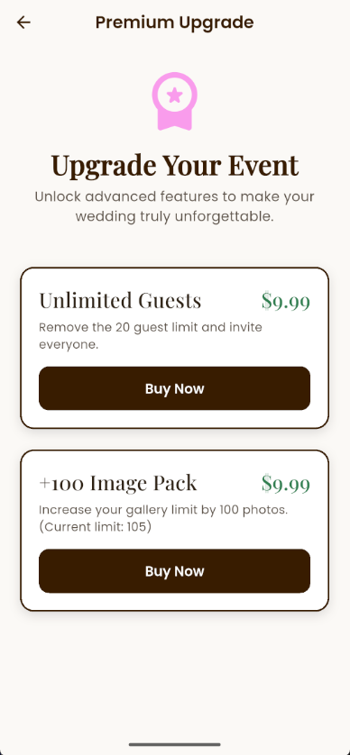

<p align="center">
    <a href="https://github.com/mazidzomader/Munasabat" target="_blank">
        
    </a>
</p>

<div align="center">

# Munasabat

### Smart Wedding Planning & Guest Management Platform

_Munasabat_ is a Flutter-based wedding planning and guest management application designed to simplify every stage of organizing a wedding. From event planning and guest invitations to QR-based check-in and wedding memories, the platform provides an all-in-one digital solution for hosts, guests, and administrators.

</div>

---

> 📌 Project developed as part of **CSE489: Android App Development** at **BRAC University**, Summer 2026.

---

<div align="center">


<br>


</div>

## How to Run Locally (Developer Setup)

This project has all the necessary configurations (including Firebase keys) already committed for your coursework grading. You do not need to reconfigure Firebase or generate new fingerprints!

### Prerequisites

- **Flutter SDK** installed (run `flutter doctor` to ensure everything is set up).

### Setup & Run

1. Clone the repository to your local machine:
   ```bash
   git clone https://github.com/mazidzomader/MUNASABAT.git
   cd MUNASABAT
   ```

2. Download all the required Flutter packages:
   ```bash
   flutter pub get
   ```

3. Launch the app on an emulator or connected device:
   ```bash
   flutter run
   ```

That's it! The app will automatically connect to the existing Firebase database and the Stripe Sandbox environment out of the box.

## Screenshots

<div align="center">

| Dashboard | Sidebar |
|:---------:|:-------:|
|  |  |

| Events | Event Gallery |
|:------:|:-------------:|
|  |  |

| Checklist | Budget Track |
|:---------:|:------------:|
|  |  |

| Guest Add | Invitation |
|:---------:|:----------:|
|  |  |

| Gifts | Send Gift |
|:-----:|:---------:|
|  |  |

| Subscription |
|:------------:|
|  |

</div>

---

## License

<p align="center">
Licensed under the MIT License, Copyright © 2026-present.
</p>
